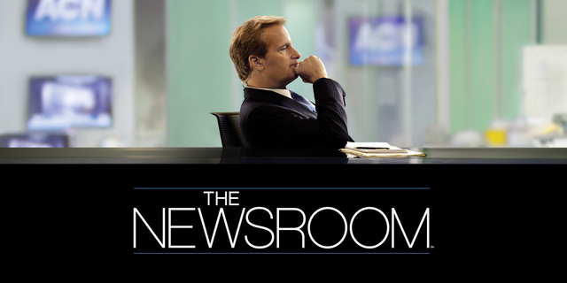
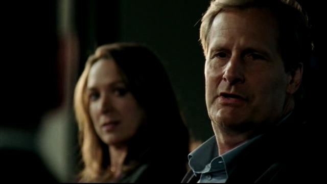
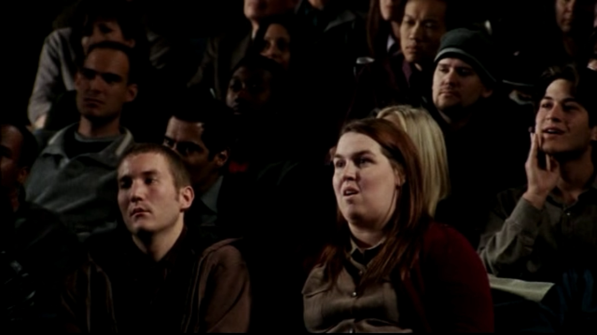
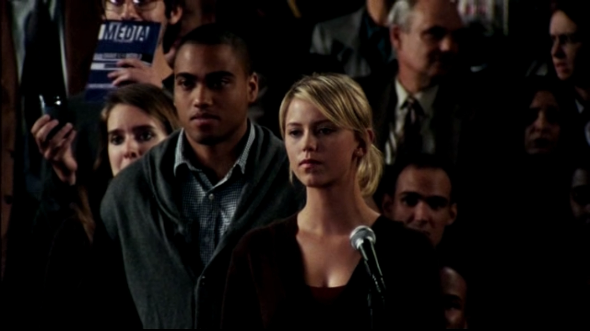

뉴스룸(The Newsroom).

처음 이 드라마를 봐야지라고 생각한 것은 아래 오프닝 영상을 보고 난 후다. 너무나도 인상 깊었다고 할까나?

<!-- [embed] https://www.youtube.com/embed/qyXiAfKrHqg?si=O5d6qSADXZADYKHr -->

>**미국은 위대한 국가가 아니다.**  
>America is NOT the greatest country in the world
>
><small>Will McAvoy in The Newsroom</small>

내가 알기로 미국은 국민들의 애국심이랄까? 나라에 대한 자부심이 매우 큰 나라라고 생각한다.
미국은 여러 분야(특히 경제, 군사)에서 세계 최고이니, 미국은 세계 최고의 나라야!
이런 느낌이랄까?
거기에 대해서 '당신들은 틀렸어!'를 외친것이다.
그 다음에 나오는 사람들의 멍한 표정은 그들에게는 너무나도 당연한 리액션이지 않을까 생각한다.

하지만 결정타는 다음에 이어진다. 미국은 한 때 가장 훌륭한 나라였다는 점을 언급하면서 말이다.

>**문제를 해결하는 첫번째 단계는 문제가 있다는 것을 인식하는 것이다.**  
>The first step in solving any problem is recognizing there is one
>
><small>Will McAvoy in The Newsroom</small>

내가 좋아하는 뉴스룸의 문구 중 하나이다.
살아가다보면 무엇인가 내 마음대로 안될 때, 한 번씩 되새겨 보는 문구가 되어버렸다.
정확히는 자기반성을 빠르게 하게 되는 것 같다.
왜냐하면 많은 문제의 원인은 나에게 있는 경우가 많기 때문에,
나에게 무슨 문제가 있는 찾아보는 것만으로도 해결책을 찾는 경우가 많았기 때문이다.

혹시나 영상을 보고 흥미가 느껴졋다면, 뉴스룸을 재미있게 볼 수 있을 것이라 생각한다.
특히, 가끔씩 흘러나오는 엔딩송은 정말 멍하니 화면을 쳐다보고 있게 할 정도로 뭉클하다.

## 되돌아보며

2014년 5월 6일 작성한 글인데, 지금 생각해보면 나에게 꽤나 큰 영향을 준 것같다.
물론 글을 작성하던 시점과는 조금 다른 방식으로 해석을 하게 되었다.

2024년 3월 25일 현재 표면적으로 보이지 않는 문제를 해결해야 한다고 생각할 때,
가장 먼저하는 일 중 하나가 모두가 문제를 인식하도록 하는 것이기 때문이다.

어떤 문제를 해결할 때 혼자서 고민하는 것보다는 여러명이서 같이 고민할 때 좋은 해결책이 나온다는 믿음하에
문제를 모두가 인지하도록 하는 것은 여러 측면에서 유용한 경우들이 많았다고 스스로 생각하기에
해결해야 하는 문제가 있을 때 이 전략(?)을 잘 활용하고 있고, 계속 잘 활용할 것 같다.